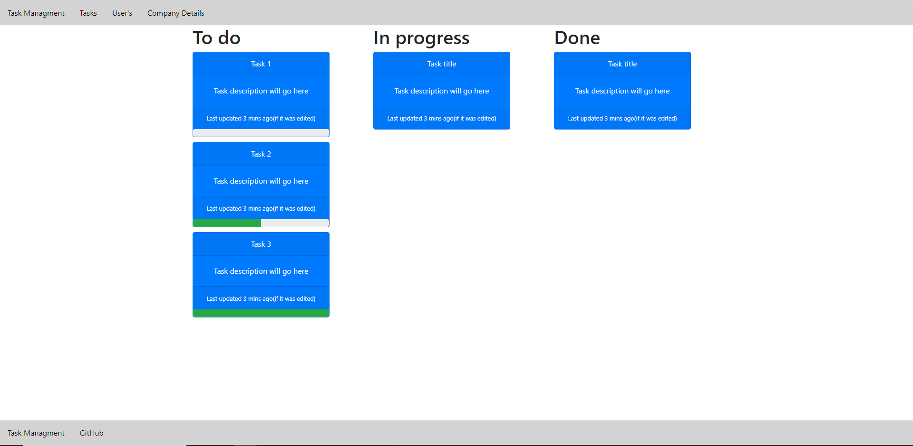
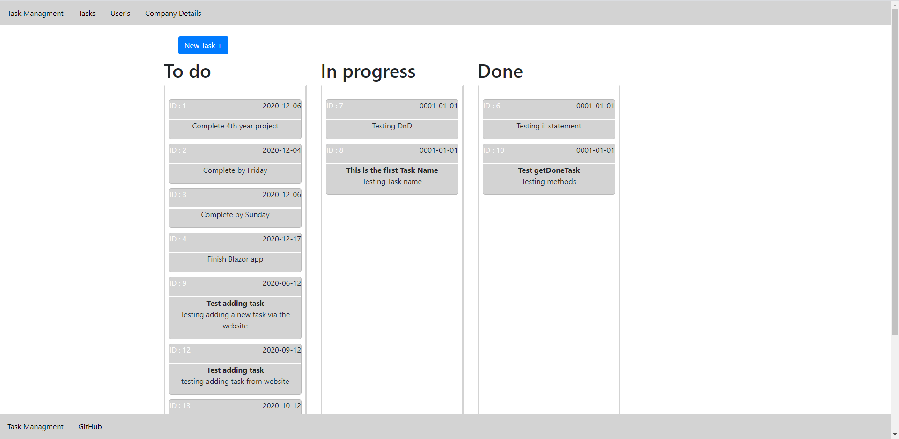
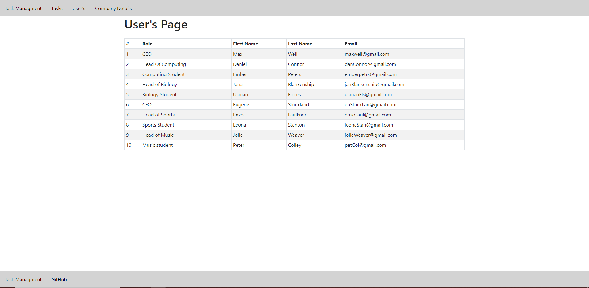
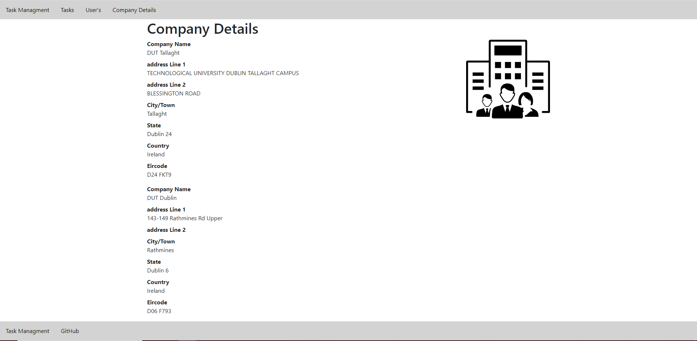

<!DOCTYPE html>
<html lang="en">

<head>
    <title>Mateus's Page</title>
    <meta charset="UTF-8">
    <meta name="viewport" content="width=device-width, initial-scale=1.0">
    <link rel="stylesheet" href="main.css">
    <link rel="stylesheet" href="https://maxcdn.bootstrapcdn.com/bootstrap/3.4.1/css/bootstrap.min.css">
    
    
    <meta name="facebook-domain-verification" content="nfaddo2ct9cnbbywsr4vr6jtkpy83e" />
    
</head>

<body>
    

        <nav class="navbar navbar-default">
        

            

                <a class="navbar-brand" href="index.html">Mateus</a>
            <ul class="nav navbar-nav">
                <li><a href="#aboutMe">About me</a></li>
                <li><a href="#education">Education </a></li>
                <li><a href="#projects">Projects</a></li>
                <li><a href="#wrkExperience">Work Experience</a></li>
                <li><a href="resources.html">Resources</a></li>
            </ul>
        

    </nav>

        

            
            
        
  

        

            <h2>Overview</h2>
            

                

                    Hi, my name is Mateus Cardoso, I am currently in my final year of studying computer science(Software development stream) in
                    <a href="https://www.it-tallaght.ie/" target="_blank">TUD Tallaght Campus.</a>
                    Before entering TUD  I completed a course in Computer Development and I got a FETAC Level 6 certification. I am young hard working individual
                    who can work well under pressure, work on its on initiative and work great with group work. This web portfolio well help you get to know me better as a person and
                    as a developer.
                

            

        

        

            <h1 id="education">Education</h1>
            

                <button class="tablinks" onclick="openYear(event, 'y4')">TUD Year 4</button>
                <button class="tablinks" onclick="openYear(event, 'y3')">TUD Year 3</button>
                <button class="tablinks" onclick="openYear(event, 'y2')">TUD Year 2</button>
                <button class="tablinks" onclick="openYear(event, 'y1')">TUD Year 1</button>
                <button class="tablinks" onclick="openYear(event, 'plc')">PLC</button>

            

            

                
                <h3><a href="https://www.stconlethscc.ie/plc.html" target="_blank">Saint Conleth's Community College - PLC</a></h3>
                 
                
I done this PLC course after I finished my Leaving Cert, I wanted to do a course before going into to college to know if I would like to do computer science. 
                    I ended up falling in love with coding and I havent gave it up since. I think this course was really important to me, I got to learn many things that has help 
                    me in IT Tallaght. It got to me friends that have made to 4th with me.

                    <table>
                        <tr>
                            <th>Module</th>
                            <th>Grade</th>
                        </tr>

                        <tr>
                            <td>Graphic User Interface Programming</td>
                            <td>Distinction</td>
                        </tr>

                        <tr>
                            <td>Work Practice</td>
                            <td>Distinction</td>
                        </tr>

                        <tr>
                            <td>Object Oriented Programming</td>
                            <td>Distinction</td>
                        </tr>
                        
                        <tr>
                            <td>Web Development</td>
                            <td>Merit</td>
                        </tr>

                        <tr>
                            <td>Software Architecture</td>
                            <td>Merit</td>
                        </tr>

                        <tr>
                            <td>Project Management</td>
                            <td>Merit</td>
                        </tr>

                        <tr>
                            <td>Communications</td>
                            <td>Pass</td>
                        </tr>

                        <tr>
                            <td>Mathematics</td>
                            <td>Pass</td>
                        </tr>

                        <tr>
                            <td>Programming and Design Principles</td>.
                            <td>Distinction</td>
                        </tr>

                        <tr>
                            <td>Games Analysis Design</td>
                            <td>Merit</td>
                        </tr>
                        
                        
                    </table>    
            

            

                
                <h3><a href="https://www.it-tallaght.ie/" target="_blank">TUD Tallaght Campus, Year 1</a></h3>
                

                    After completing my PLC course I decided to come to what was then IT Tallaght, One of my PLC Lectures suggested Tallaght to me as it is one of the best college for Computer Science espicially for me who like to be very hands with the computer.
                    Year 1 in IT Tallght was a new experience for me as I never been to a college, but in learning terms it was just like a refresher from my PLC but in IT Tallaght there was more content in Year 1.
                

                <table>
                    <tr>
                        <th>Module</th>
                        <th>Grade</th>
                    </tr>

                    <tr>
                        <td>Software Development 2</td>
                        <td>B+</td>
                    </tr>

                    <tr>
                        <td>Object Oriented System Analysis</td>
                        <td>A</td>
                    </tr>

                    <tr>
                        <td>Social Media Communications</td>
                        <td>B+</td>
                    </tr>

                    <tr>
                        <td>Statistics</td>
                        <td>B-</td>
                    </tr>

                    <tr>
                        <td>Database Fundamentals</td>
                        <td>B</td>
                    </tr>

                    <tr>
                        <td>Operating System Fundamentals</td>
                        <td>B+</td>
                    </tr>

                    <tr>
                        <td>Software Development 1</td>
                        <td>A</td>
                    </tr>

                    <tr>
                        <td>Computer Architecture</td>
                        <td>B+</td>
                    </tr>

                    <tr>
                        <td>Fundament of Interface & Web</td>
                        <td>B+</td>
                    </tr>

                    <tr>
                        <td>Business & Information System</td>
                        <td>C+</td>
                    </tr>

                    <tr>
                        <td>Discrete Mathematics 1</td>
                        <td>B</td>
                    </tr>

                    <tr>
                        <td>Learning to Learn at 3rd Level</td>
                        <td>B+</td>
                    </tr>
                    <tr>
                        <th>GPA</th>
                        <th>3.35</th>
                    </tr>
                </table>
                
            

            

                
                <h3><a href="https://www.it-tallaght.ie/" target="_blank">TUD Tallaght Campus, Year 2</a></h3>
                

                    Year 2 in IT Tallaght was a very good year with loads of experience, in year 2 for the first time I was put in a group to do a big project and really get the feel of what is like to work with-in a team. The project specs was that we had to build a
                    website when a customer could pay or buy something. After looking for many ideas we decided to go with a car sales website, and for the payment we thought we would have the customer pay for the deposit of the car.
                

                <table>
                    <tr>
                        <th>Module</th>
                        <th>Grade</th>
                    </tr>

                    <tr>
                        <td>Software Development 4</td>
                        <td>b-</td>
                    </tr>

                    <tr>
                        <td>Project</td>
                        <td>C+</td>
                    </tr>

                    <tr>
                        <td>Routing & Switching Essentials</td>
                        <td>c</td>
                    </tr>

                    <tr>
                        <td>Management Science</td>
                        <td>B</td>
                    </tr>

                    <tr>
                        <td>Database Admin & Analysis</td>
                        <td>C+</td>
                    </tr>

                    <tr>
                        <td>Information Security</td>
                        <td>D</td>
                    </tr>

                    <tr>
                        <td>Software Development 3</td>
                        <td>A</td>
                    </tr>

                    <tr>
                        <td>Software Quality Assurance & Testing</td>
                        <td>B</td>
                    </tr>

                    <tr>
                        <td>Network Fundamentals</td>
                        <td>C+</td>
                    </tr>

                    <tr>
                        <td>Advanced Database Technologies</td>
                        <td>C</td>
                    </tr>

                    <tr>
                        <td>Discrete Mathematics 2</td>
                        <td>C</td>
                    </tr>

                    <tr>
                        <td>Client side Web Development</td>
                        <td>B+</td>
                    </tr>

                    <tr>
                        <th>GPA</th>
                        <th>2.60</th>
                    </tr>
                </table>
            

            

                
                <h3><a href="https://www.it-tallaght.ie/" target="_blank">TUD Tallaght Campus, Year 3</a></h3>
                

                    Third Year for me was one of the hardest year, it felt like there was a lot of pressure but I was able to get through it. The first semester of 
                    third year was just a normal college semester but we were also looking for internship position. I applied to many companies got a lot of 
                    interview skills. I will talk about my internship experience under Work experience.

                <table>
                    <tr>
                        <th>Module</th>
                        <th>Grade</th>
                    </tr>

                    <tr>
                        <td>Experiental Learning</td>
                        <td>PASS</td>
                    </tr>
                    
                    <tr>
                        <td>Server-side Web Development</td>
                        <td>D</td>
                    </tr>

                    <tr>
                        <td>Operating Systems</td>
                        <td>C</td>
                    </tr>

                    <tr>
                        <td>Cloud Service & Distrib</td>
                        <td>D</td>
                    </tr>

                    <tr>
                        <td>Big Data Technologies</td>
                        <td>B-</td>
                    </tr>
                    
                    <tr>
                        <td>Data Structures & Algorithms</td>
                        <td>C+</td>
                    </tr>

                    <tr>
                        <td>Data Analysis</td>
                        <td>C</td>
                    </tr>

                    <tr>
                        <th>GPA</th>
                        <th>2.04</th>
                    </tr>
                </table>
            

            

                
                <h3><a href="https://www.it-tallaght.ie/" target="_blank">TUD Tallaght Campus, Year 4</a></h3>
                

                    Fourth Year has been an experience, a lot of work to do, got to be always working and try your best not fall behind because it can be a very bad fall.
                    Taking out the work load this year has been an awesome year, from not having to go to college and studying at home, I felt like I could have done all the 4 years
                    like this, as I live far from college it was a trip to get to college and back. The classes are recorded and I just think there many benefits from doing college at home 
                    for me anyways. Grade are "Not applicable" the semester has not ended yet.
                

                <table>
                    <tr>
                        <th>Module</th>
                        <th>Grade</th>
                    </tr>

                    <tr>
                        <td>Applied Machine Learning</td>
                        <td>Not applicable</td>
                    </tr>

                    <tr>
                        <td>4th Year Project</td>
                        <td>Not applicable</td>
                    </tr>

                    <tr>
                        <td>Enterprise Applications Development 1</td>
                        <td>Not applicable</td>
                    </tr>

                    <tr>
                        <td>Information Management</td>
                        <td>Not applicable</td>
                    </tr>

                    <tr>
                        <td>Interactive Media Design & Visualisation</td>
                        <td>Not applicable</td>
                    </tr>

                    <tr>
                        <td>Enterprise Performance Architecture</td>
                        <td>Not applicable</td>
                    </tr>

                </table>
            

            

        

        
        

            

                <h1>Project's</h1>
                

                    <button class="tablinks" onclick="openproj(event, 'tm')">Task Management</button>
                    <button class="tablinks" onclick="openproj(event, 'cs')">Car sales</button>
                

            

                

                    <h3>Task Management</h3> 
                    
This is my fourth year project, I came up with the idea from my internship as we had a software for task management when I got in but later on in the internship we
                        moved into a different software and everyone felt like the UI was kind of bad as we had to do a lot of more clicks to get to do what we wanted. So I wanted to create
                        something easy for all types of companies to be able to use or self employed people, very simple with good UI for the user where they can learn to use the software with-in 5mins.
                        I am using React as my framework as I found it easier to learn as there isnt much rules like Angular, I am using Microsoft azure for my backend I choose Azure as I have worked with it before
                        so I am quite used to the software and how things work. I am using C# to develop my API so my react application can talk to my database. So far it has been smooth sailing and I havent run into 
                        any major problems where I was stuck for a long time so I am very happy with that and I hope it goes that way till the end but its coding so there will be problems. The photos below are the 
                        work I have done so far in the project. And from that I can give you more of an insight of what I want the project to be and look like. 
                    

                    

                        <h4 class="pssImages">Home Page</h4>
                        
                        
My plan for the home page is to have some stats for the user, espicially for the CEO of the company. So some of the stats are going to be a pie chart with 
                            how many task are in the "To Do" column, in the "In Progress" column and in the "Done" column. Also some of the other stats are going to be how many task has been completed 
                            in the year so, how many employees in each department, maybe have a drop down to select a department and see how that individual department is doing, with the pie chart, staff
                            employed, average task completion time and so on. Right now what you see what the initial design for my task page, that how I wanted the task's to look like but me and my project 
                            supervisor found that the blue was a very strong colour so I decided to go and make my own cards for the task which you will see on the next page. 
                        

                        
                        <h4 class="pssImages">Task Page</h4>
                        
                        
My plan for the task page is to make the task card look nicer, place the "Add New Task" button somewhere more convenient for the users. Have the footer at the bottom of the 
                            page and not like the way it is in the picture as it gets in the way of the task. I am also looking to put a scroll feature in each column as there could many and many task in a column. I am going to change the colour of the ID make it a little more hidden.
                        

                        <h4 class="pssImages" >User's Page</h4>
                        
                        
My plan for the user's page is to display all the user's with-in the company if you are the CEO, If you are a manager or employee display the users with-in that department. I am 
                            hoping to make a few little changes on this page to make it look nicer but nothing major.
                        

                        <h4 class="pssImages">Company Page</h4>
                        
                        
My plan for the company page is what you are seeing right now, expect right now is showing all the company in the database as the is no user session once I add that into to my project 
                            the CEO will the only one that will be able to edit the company details and all other users will only be able to read.
                        

                        <!--<button class="display-left" onclick="plusDivs(-3)">&#10094</button>-->
                        <button class="display-right" onclick="plusDivs(3)">&#10095</button>
                        <!--
**Please note that clicking previous while the slideshow is at the Home page will break the slideshow**
-->
                    

                
                

            

            

            
 
                <h3>Car Sales</h3>      
                
This Project was my second year project, it was done in a group of 4. We had an entire semester to come up with an idea of what we wanted to do for the project, so that
                    was more then enough time to do think about it. We all decided to do a car sale website as the time everyone had recemtly gotten a car or already had a car for a while, so 
                    we already knew the type of things a customer looking to get a new car would look for as the whole group has been through that experience.  
                    Since this was a group project, we decided to divide the work equally so everyone in the group got 4 task to complete in the project. SO, my 4 task was "Browse through cars in the database",
                     "Add car image", "Administrator Updates User" and "User comment Forum". Looking back now theses task were simple enough to do, but the hardest one for me was to browse through the cars in the database
                     I could only get it to browse by the car model and not by both car model and car brand which was really disappointing. To add a car image was simple as well and the rest was easy enough to do. 
                     I feel like if this project was given on 3rd year I could have produced better grades for myself and a better overall project. In the end the website didnt come out as we wanted to but the functionalities 
                     were there, the design wasn't so great which was disappointing and I would say its were we lost a lot of marks. unfortunately, I do not have any picture of the project anymore.
                
          
            

            

            

        
<!--"projectsDone"-->

        
<!--project"-->

        

            <h2>Work Experience</h2>
            

                

                    
                

                

                    <a href="https://www.odysseyvc.com/" target="_blank"><h3 class="media-heading">Odyssey VC</a> - <a href="https://www.compliantcloud.com/" target="_blank">Compliant Cloud</a></h3>
                    <h4>internship</h4>
                    
For my internship position I was working as a Software Test Support Engineer. I started on January and went up till August. Odyssey VC was a great company to 
                        work for, the first day I got there the people was really welcoming, friendly and the atmosphere was great. I actually got placed in the "Compliant Cloud" which 
                        is a sub company of Odyssey VC that deals with the Technology side of the company that focus on moving compliant applications to the cloud. 
                        
My main Task were:

                        <ul>
                            <li>Preparing Test Scripts based on user stories</li>
                                
My manager would usually write the user stories and from reading the user stories I would have to create test scripts.

                            <li>Help troubleshoot issues</li>
                                
If I was to find a bug on the site, I would have to help the developer with the bug from to why the bug might be happening and how to fix it.

                            <li>Scheduling automated testing</li>
                                
Automated test were usually done at the end of each patch update, so once all the feature was completed and tested we would run a automated test script that 
                                    would run in 4 type of web browser, Chrome, Firefox, Explorer and Safari in Mac OS and if some test were to fail, I would 90% of the time it would be on Safari.
                                    We didnt have a Mac laptop or desktop to test the features on Safari so we used a software that worked like virtual machine to test on Safari.
                                

                            <li>Participate in project coordination, documentation and reporting</li>
                                
I would go to meetings with my managers and team and they would actually listen other people opinion, I really like that about this company as it didnt feel like only the managers opinion were the ones that mattered.

                            <li>Provide outstanding customer service and follow up</li>
                                
On the Compliant Cloud website we had a chat, and I was in charge in being active and responding to anyone that started a chat. I only got to answer people on the chat once or twice as people would rarely use it.

                            <li>Write Bug reports</li>
                                
If I was to find a bug I would need to make a report on it, include screenshots if possible and assign it to one of our developers.

                        </ul>
                         
                        
Main Technology used :

                        <ul>
                            <li><a href="https://www.leapwork.com/" target="_blank">Leap Work</a></li>
                            
We used LeapWork to run our test scripts, and automated testing.

                            <li><a href="https://slack.com/intl/en-ie/" target="_blank">Slack</a></li>
                            
Slack was used for the purpose of communicating with people in the work place.

                            <li><a href="https://www.zoho.com/sprints/" target="_blank">Zoho Sprints</a></li>
                            
We used Zoho sprints to write our user stories, bug and task to do.

                            <li><a href="https://www.livechat.com/" target="_blank">LiveChat</a></li>
                            
We used LiveChat for the Compliant Cloud website.

                            <li><a href="https://www.sysaid.com/" target="_blank">SysAid</a></li>
                            
We used SysAid with our web application, SysAid is where would store Orders, services, tickets and a few more things.

                        </ul>
                    

                

                
            

            

                

                    
                

                

                    <a href="http://www.scoilmhuire.net/" target="_blank"><h3 class="media-heading">Scoil Mhuire Senior School</h3></a>
                    <h4>Work Experience</h4>
                    
For my PLC I had to do work experience related to computer science so me and some of my friend decided to ask a school if we could teach third-fifth classes student <a href="https://scratch.mit.edu/" target="_blank">Scratch</a> basics. The schopol was happy to have us there, we were
                        really happy they accepted us. We had only 1 hour every week, we decided to have 3-4 week with each class so we came up with a plan for each class that by the end of the 3-4 week they would have a playable game. 
                        
My main Task were:

                        <ul>
                            <li>Teaching Plan</li>
                                
We had to come upo with teaching plans of what were going to do in that week with the class

                            <li>Power Points</li>
                                
So just like teachers and Lectures, we had to make power points to the class so they could follow along with the task we had for them.

                            <li>Help Kids</li>
                                
We would also help that were behind or stuck on a part, and let me tell you that sometimes they were able to get error that I never saw so it was really an amazing experience

                        </ul>
                         
                        
Main Technology used :

                        <ul>
                            <li><a href="https://scratch.mit.edu/" target="_blank">Scratch</a></li>
                                
We used <a href="https://scratch.mit.edu/" target="_blank">Scratch</a> to build the games with the kids

                            <li>PowerPoint</li>
                                
We used Microsoft PowerPoint to make presetation for the kids, and show how things were done and teach them the concepts behind it.

                            <li>Microsoft Word</li>
                                
We used Word to make the lesson plans and also report on how the classes went.

                        </ul>
                    

                

                
            

        

            

                <h2>Hobbies </h2>
                

                    

                        </a>
                    

                    

                        <h4 class="media-heading">Boxing</h4>
                    

    
                

                

                    

                        </a>
                    

                    

                        <h4 class="media-heading">gaming</h4>
                    

    
                

                

                    

                        </a>
                    

                    

                        <h4 class="media-heading">Cooking</h4>
                    

    
                

                

                    

                        </a>
                    

                    

                        <h4 class="media-heading">Music</h4>
                    

    
                

                
            

            

        

            
            

                <h3>Social Media's</h3>
                <a href="https://github.com/teu100" target="_blank"><a href="https://github.com/teu100" target="_blank"> GitHub</a>   
                 
                 
                <a href="https://www.linkedin.com/in/mateus-cardoso/" target="_blank"><a href="https://www.linkedin.com/in/mateus-cardoso/" target="_blank"> Linked In</a> 
                 
                 
                <a href="MateusCardoso.docx" download><a href="MateusCardoso.docx" download>Download CV</a>       
            

            
            

                
                <form id="MeForm" class="form-horizontal">
                    <h3>Contact Me</h3>
                    

                        <label class="control-label col-sm-2" for="firstName">First Name: </label>
                        

                        <input type="text" class="form-control" id="firstName" name="firstName" placeholder="Your First Name" width="50%"/>
                        

                    

                    

                        <label class="control-label col-sm-2" for="lastName">Last Name: </label>
                        

                        <input type="text" class="form-control" id="lastName" name="lastName" placeholder="Your Last Name"/>
                        

                    

                    

                            <label class="control-label col-sm-2" for="userEmail">Email:</label>
                            

                              <input type="email" class="form-control" id="userEmail" placeholder="Enter email" name="userEmail">
                            

                    

                    

                        <label class="control-label col-sm-2" for="emailSubject">Subject: </label>
                        

                        <input type="text" class="form-control" id="emailSubject" name="emailSubject" placeholder="Email Subject"/>
                        

                    

                    

                        <label class="control-label col-sm-2" for="emailBody">Message: </label>
                        

                            <textarea type="text-area" class="form-control" id="emailBody" name="emailBody" placeholder="Email Message..."></textarea>
                        

                    

                    <button type="reset; submit;" class="btn btn-primary" onclick="contactMeSubmit()">Send</button>
                </form>
                
            

            
        

    

</body>

</html>
